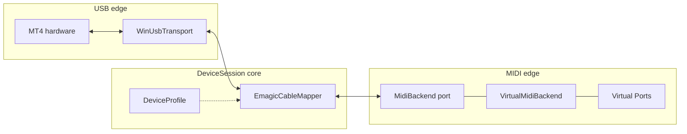
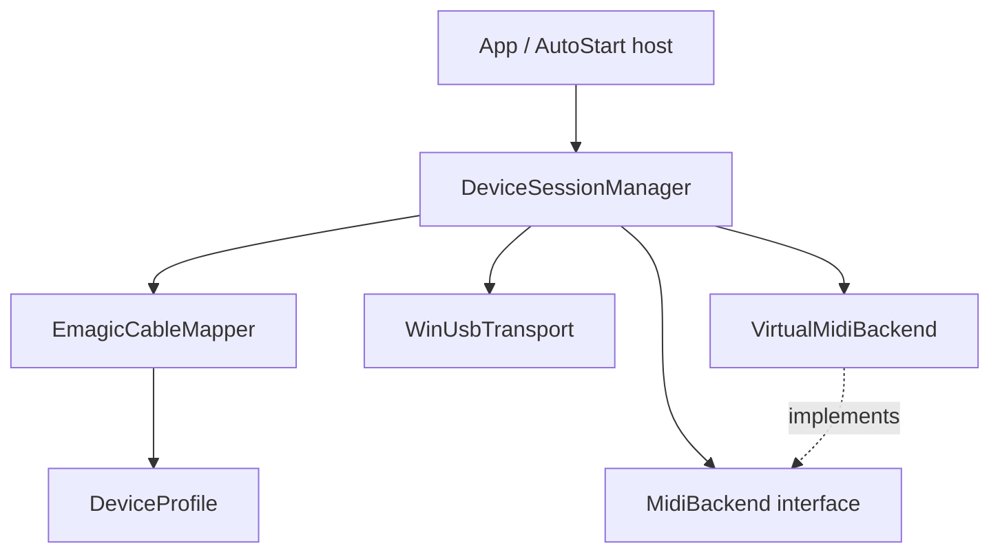
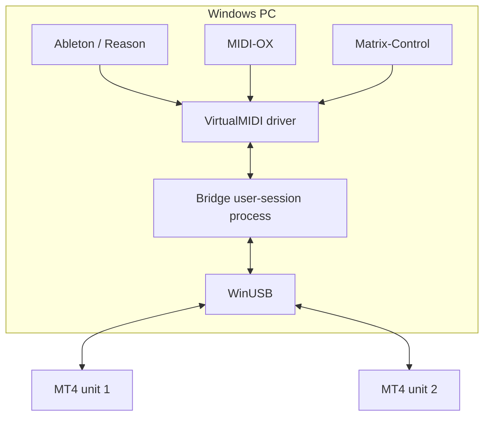

# Architecture Spine — unitor-win64-driver V1

## Design Paradigm

**Ports and adapters** around a **device-session pipeline**.

Each connected MT4 owns one **DeviceSession**. Inside the session, MIDI bytes flow:

`WinUsbTransport` ↔ `EmagicCableMapper` ↔ `MidiBackend` (V1: VirtualMIDI)

Adapters sit at the edges (USB, virtual MIDI). The mapper and session lifecycle are the core. Product rules from the PRD are binding inputs — this spine fixes only the non-obvious mechanisms builders would otherwise diverge on.



## Invariants & Rules

### AD-1 — Usermode device-session pipeline `[ADOPTED]`

- **Binds:** FR-2, FR-6..FR-8, non-goals (no custom kernel MIDI)
- **Prevents:** Kernel MIDI driver, or scattering Emagic mapping into WinUSB/INF glue
- **Rule:** All Emagic cable multiplex/demultiplex runs in a C++17 usermode process. V1 forbids a custom kernel MIDI driver and forbids a home-grown kernel “VirtualMIDI Plan B.”

### AD-2 — Module boundaries and dependency direction

- **Binds:** all Bridge source units
- **Prevents:** Circular deps; VirtualMIDI types leaking into the mapper; protocol code calling installer/CI
- **Rule:** Allowed dependency direction (inner ← outer forbidden):



`EmagicCableMapper` and `DeviceProfile` must not include VirtualMIDI or WinUSB headers. `VirtualMidiBackend` is the only V1 `MidiBackend` implementation. A future Windows MIDI Services backend (Win11-only) implements the same interface — it is not a V1 deliverable.

### AD-3 — DeviceProfile is declarative and multi-PID-ready `[ADOPTED]`

- **Binds:** FR-16, addendum hardware table
- **Prevents:** Hard-coded MT4 masks in mapper logic; promising cousin products without hardware; mask-vs-cable-index mismatch between profile authors and mapper authors
- **Rule:** Per USB identity, a `DeviceProfile` declares at least: `vid`, `pid`, `in_cables` mask, `out_cables` mask, `ifnum`, and capability flags (Patch / LTC / FastMode — **off** for V1 MT4). Masks are **Linux quirk-shaped bitmasks** (`uint16`): bit `i` set means cable index `i` is present; **Port N** is the N-th present cable in ascending bit order starting at **N=1** (MT4: bits yielding Port 1..2 IN and Port 1..4 OUT). V1 ships and validates only the MT4 profile (`086A:0003`, `in_cables=0x8003`, `out_cables=0x800f`, `ifnum=2`). Cousin rows may exist as data stubs; shipping them as products requires hardware-gated stories.

### AD-4 — One DeviceSession per MT4 instance `[ADOPTED]`

- **Binds:** FR-10, FR-4, UJ-3
- **Prevents:** Shared mutable USB handle across units; Emagic cascade topology
- **Rule:** Each enumerated MT4 gets an independent `DeviceSession` (own WinUSB handle, mapper state, Virtual Port set). Emagic-style cascaded/stacked multi-interface topologies are out of V1. Two units on one PC = two sessions, not one multiplexed cascade.

### AD-5 — Port naming (including multi-MT4) `[ADOPTED]`

- **Binds:** FR-5, OQ-6
- **Prevents:** Ambiguous DAW recalls when two MT4s are present; random rename on replug; MidiBackend inventing its own ordinal
- **Rule:**
  - Topology per unit: **2 IN + 4 OUT** Virtual Ports (physical shape), not per-channel floods.
  - Unit ordinal `K` is assigned **only** by `DeviceSessionManager` (AD-6) and passed into `MidiBackend` as ready-made display names — backends must not re-derive `K`.
  - Display names:
    - `K == 1`: `MT4 Port N` for `N` in `1..4`
    - `K >= 2`: `MT4 #K Port N` for `N` in `1..4`
  - IN and OUT appear as separate selectable endpoints as Windows UI requires; the same `MT4 … Port N` label is used on both sides for cable `N`.
  - Example (two units): unit 1 → `MT4 Port 1`…`MT4 Port 4`; unit 2 → `MT4 #2 Port 1`…`MT4 #2 Port 4`.

### AD-6 — Stable unit identity for naming and recall

- **Binds:** FR-5, FR-10, FR-11
- **Prevents:** Port names swapping between two MT4s after reboot/replug; dual owners of ordinal `K`
- **Rule:** `DeviceSessionManager` is the sole owner of unit identity → ordinal `K` mapping. Prefer USB serial string when present; otherwise a durable local map keyed by USB topology path (`bus/port` chain) persisted by the Bridge. Ordinal `K` must not reshuffle for a known unit while another unit is (un)plugged. `[ASSUMPTION: MT4 exposes a usable USB serial string on typical units; if not, topology-path map is authoritative.]`

### AD-7 — MidiBackend: interim VirtualMIDI; next community = Windows MIDI Services `[ADOPTED — course-corrected 2026-08-10]`

- **Binds:** FR-2, FR-12, glossary VirtualMIDI / Windows MIDI Services
- **Prevents:** Manual-only loopMIDI UI as the product path; forking GPL integration samples as base; blocking community strategy on VirtualMIDI redistribution clearance
- **Rule (interim lab / personal through Epic 5):** The Bridge creates and destroys Virtual Ports via the VirtualMIDI **SDK**. The VirtualMIDI **driver must be present** (eval: loopMIDI/rtpMIDI). Do **not** redistribute Bridge/Setup binaries that use the SDK as a community release (OQ-1 out of community scope). Do not fork `aaron1a12/virtual-midi` (GPL + vendored SDK); it is integration existence proof only.
- **Rule (next community — Epic 6):** Implement a Windows MIDI Services `MidiBackend` on **Win11 only**. That path is the intended vehicle for public MIT binaries without depending on virtualMIDI SDK redistribution clearance. Win10 drops as a community claim after cutover.

### AD-8 — Multi-client VirtualMIDI (OQ-7) `[ADOPTED]`

- **Binds:** FR-9, SM-7
- **Prevents:** Designing exclusive-lock MIDI ownership in the Bridge
- **Rule:** VirtualMIDI supports multiple applications opening the same virtual port concurrently (author docs: up to **8** clients per port). V1 acceptance hosts are those locked in the PRD Validation Matrix (Ableton Live 12, Reason Studios 12, MIDI-OX, Matrix-Control on Win10 x64 + Win11 x64) — Architecture does not reopen host SKUs. Concurrent DAW + MIDI-OX on the same relevant ports is required. The Bridge must not add an exclusive-open policy on top. Document the 8-client ceiling in user/tech docs. Host-specific quirks (if any) are documented when observed — they do not change this rule.

### AD-9 — Port lifecycle tied to DeviceSession

- **Binds:** FR-2, FR-4, FR-11
- **Prevents:** Orphan Virtual Ports after unplug; ports without a live session; dual create/destroy authorities
- **Rule:** **Only** a live `DeviceSession` may create or destroy that unit’s Virtual Port set, and it does so **exclusively** through `MidiBackend` APIs (no App/hot-plug path creating ports before a session exists). Session start → create ports with AD-5 names; session teardown (including unplug) → **destroy** those ports via the SDK (no parallel “mark unavailable while keeping ports alive” mode). Recovery after replug is a **new** session that recreates ports under AD-6 identity. Whether the UI asks the user to acknowledge a Bridge restart remains AQ-2 — it must not fork a second lifecycle owner.

### AD-10 — Auto-Start and hot-plug `[ADOPTED]`

- **Binds:** FR-3, FR-11, SM-4, SM-5
- **Prevents:** Manual launch every session; reboot-as-recovery
- **Rule:** Bridge registers for Windows logon/start and/or MT4 USB arrival so the happy path needs no manual launch. After unplug/replug, usable ports return without a Windows reboot; host rescan and/or supervised Bridge restart are allowed and must be documented. Requiring a reboot is a V1 failure.

### AD-11 — MIDI Path measurement harness (OQ-2)

- **Binds:** NFR-P1..P3, SM-9, Studio-Done Gate
- **Prevents:** ASIO buffer size used as MIDI proof; unpublished “feels fine” timing claims
- **Rule:**
  - Measure the **MIDI Path** only (Virtual Port ↔ Bridge ↔ WinUSB ↔ device path as applicable) — never ASIO buffer size.
  - Harness lives in-repo under `tools/midi-path-harness/` (C++17), built to `builds/`.
  - Method: timestamped inject/observe using high-resolution clocks (`QueryPerformanceCounter` or equivalent); publish host OS, Bridge build, VirtualMIDI presence, and whether the path is software-loop (Virtual Port round-trip through Bridge) or hardware-loop (MT4 physical loopback when available).
  - Results publish under `docs/dev/measurements/` (method + latest tables). Provisional anchors remain until Studio-Done Gate revises them: healthy bridge-added ≤ **4–5 ms** p99; jitter ≤ **1–2 ms** p99; do-not-ship-worse ~**8–10 ms** p99.
  - `[ASSUMPTION: first harness iteration uses a Bridge-mediated Virtual Port software loop; hardware loopback is added when a physical loop cable/setup is available.]`

### AD-12 — Installer: WinUSB association + VirtualMIDI prerequisite + UX bar

- **Binds:** FR-1, FR-12, SM-5
- **Prevents:** Zadig-as-primary community path; silent empty ports when VirtualMIDI missing; transport opening the wrong device interface
- **Rule:**
  - **Primary community path:** custom INF (or co-installer) associating MT4 `USB\VID_086A&PID_0003` (and interface as required) with Microsoft **WinUSB**, registering project DeviceInterfaceGUID `aa209017-cf8a-49ad-a0e7-701187ff7e05`. Firmware OS-descriptor auto-WinUSB is **not** assumed (device firmware is fixed).
  - **`WinUsbTransport` must open the device via that DeviceInterfaceGUID** (not VID/PID string match alone).
  - **Developer fallback:** Zadig — documented for contributors only, not the primary user path.
  - **VirtualMIDI:** installer checks driver presence; if missing, blocks with an obvious fix path (install loopMIDI/rtpMIDI for eval, or licensed MSI when cleared). Do not present empty port lists as success.
  - **UX acceptance checklist (short):** (1) few steps, (2) visible progress, (3) clear success screen, (4) VirtualMIDI prerequisite explicit, (5) WinUSB association succeeds, (6) Auto-Start wired, (7) one-time admin OK / daily admin not required, (8) minimal jargon.
  - Exact installer technology (WiX / Inno / other) is implementation choice under this checklist — not a second product decision.

### AD-13 — CI and dual-machine loop (OQ-5)

- **Binds:** NFR-D3, conventions builds path
- **Prevents:** Mac-only “green” with no Windows compile; undocumented validate gap; silent CI image drift
- **Rule:**
  - **Minimum CI:** Windows hosted build of the Bridge (and harness when present) on every PR / main push — compile must pass.
  - **Edit / validate split:** primary edit on macOS + Cursor; USB, DAW, SysEx, and Studio-Done measurements on Windows 10/11 x64 (Win10 mandatory in matrix). Document this loop in contributor docs.
  - Artifact output directory is **`builds/`** (never `build/` at repo root).
  - Pin a **specific** GitHub Actions Windows runner image at first scaffold (prefer `windows-2022`); do not rely on floating `windows-latest` as the long-term pin. `[ASSUMPTION: CMake 3.20+ minimum; raise if the pinned VS generator requires newer CMake.]`

### AD-14 — Emagic protocol orientation (OQ-4) `[ADOPTED]`

- **Binds:** FR-2, FR-14, license honesty
- **Prevents:** Vendoring GPL Linux sources; undocumented protocol guesses
- **Rule:** Reimplement Emagic cable mapping under MIT. **Reference only** (read, do not copy into tree): Linux `sound/usb/midi.c` + `quirks-table.h` (`QUIRK_MIDI_EMAGIC`). If behavior is ambiguous, capture USB bulk traffic on Windows against a working reference path and document findings under `docs/dev/`. No GPL sources in the repository.

### AD-15 — Quality gate when C++ exists `[ADOPTED]`

- **Binds:** conventions.md §3, NFR quality
- **Prevents:** Merging C++ that skips the project analyser
- **Rule:** Touched C++ under `src/` must pass `python scripts/quality/lint-touched.py` (and compile) before task close. Sources under `src/` use **PascalCase** filenames; repo folders stay kebab-case. No French in source.

### AD-16 — Transparent SysEx transport `[ADOPTED]`

- **Binds:** FR-8, §10 SysEx vectors, Matrix-Control extract
- **Prevents:** Bridge interpreting/rewriting Oberheim Matrix framing
- **Rule:** The Bridge carries SysEx (including Matrix-Control Oberheim Matrix frames) transparently between Virtual Ports and MT4 cables. No Emagic-side framing of Oberheim payloads. Minimum pass vectors remain those locked in the PRD (Device Inquiry, patch dump ~275 B, master dump ~351 B, push, live edits; bank stress optional; mixed-wire tolerance).

### AD-17 — MIDI transport coverage `[ADOPTED]`

- **Binds:** FR-6, FR-7, SM-1
- **Prevents:** Notes-only bridge that drops clock/MTC/transport realtime
- **Rule:** V1 transport carries channel MIDI (notes, CC, common channel/system messages), MIDI clock (`0xF8`), Start / Stop / Continue, and MTC (quarter-frame and full-frame used for sync), in addition to SysEx (AD-16). Dropping any of these classes is a V1 defect, not a deferred nicety.

### AD-18 — Session reliability and SysEx buffering `[ADOPTED]`

- **Binds:** NFR-R1, NFR-R3, SM-3
- **Prevents:** Designs that require Bridge restart for normal librarian dumps or fail ~4h studio use
- **Rule:** The Bridge is designed for about **4 hours** continuous studio/editor use (including SysEx Sessions) without a mandatory restart for normal operation. SysEx bursts for Matrix-Control librarian vectors must be buffered/queued so dumps complete without Bridge restart under the PRD pass vectors. Incomplete/corrupt dumps under those vectors are failures.

### AD-19 — User docs, facade, and unsigned-build honesty `[ADOPTED — course-corrected 2026-08-10]`

- **Binds:** FR-13, FR-14, FR-15, SM-5, SM-6
- **Prevents:** Contributor-only docs; missing SmartScreen guidance; unclear public identity; polished commercial oversell without cert
- **Rule:** Shipped **user** docs cover MIDI-backend prerequisites, install, Auto-Start, first MIDI test, first SysEx test, troubleshooting, and an explicit works / does-not-work list. Public facade is **Ten Square Software**. Unsigned public builds (when shipped) require SmartScreen “Run anyway” docs. Certificate purchase is **no certificate purchase** (OQ-3). Clean-PC WinUSB without trusted catalog uses a **guided** association path — not promised via Setup-alone.

### AD-20 — Bridge runtime host `[ADOPTED]`

- **Binds:** FR-3, AD-10, operational envelope
- **Prevents:** One epic shipping a Session-0 Windows Service while another ships a tray app with incompatible Auto-Start wiring
- **Rule:** The Bridge runs as a **user-session** process (interactive logon session), **not** a Session-0 Windows Service. Auto-Start uses logon registration (e.g. Task Scheduler at logon and/or Run-key equivalent) and/or USB device-arrival start so VirtualMIDI and DAW clients share the user session. Exact scheduler vs Run-key mechanism is an implementation detail under this rule.

## Consistency Conventions

| Concern | Convention |
| --- | --- |
| Naming (ports) | AD-5 strings exactly; unit ordinal `#K` with space before `Port`; `K` owned by DeviceSessionManager only |
| Naming (C++ files) | PascalCase under `src/` (`DeviceProfile.h`, `EmagicCableMapper.cpp`) |
| Naming (repo dirs) | kebab-case (`docs/dev/`, `tools/midi-path-harness/`, `scripts/quality/`) |
| Build output | `builds/` only |
| USB identity | VID/PID hex uppercase in docs (`086A:0003`); WinUSB DeviceInterfaceGUID `aa209017-cf8a-49ad-a0e7-701187ff7e05` |
| Cable masks | Linux quirk bitmasks; Port N = N-th set bit ascending (AD-3) |
| Validation Matrix | Inherited from PRD §10 — Ableton Live 12, Reason Studios 12, Matrix-Control, MIDI-OX; Win10 x64 + Win11 x64 |
| Public facade | Ten Square Software |
| Errors | Fail closed on missing VirtualMIDI / WinUSB bind; user-visible message + doc link — no silent empty success |
| Logging | English diagnostic strings; enough to diagnose session start/stop, hot-plug, SysEx burst failures |
| Config | DeviceProfiles as declarative data (header/table or resource) — not scattered literals |
| License messaging | MIT (this repo) ≠ VirtualMIDI (proprietary) ≠ Windows MIDI Services (future backend) |

## Stack

| Name | Version / pin |
| --- | --- |
| Language | C++17 |
| Platform | Windows 10 x64 + Windows 11 x64 (Win10 mandatory in validation matrix) |
| USB API | WinUSB (`winusb.sys` / `winusb.dll`) |
| MIDI backend (interim lab) | VirtualMIDI SDK (Tobias Erichsen) — lab/personal only; pin SDK if needed (AQ-3); no community binary redistrib |
| MIDI backend (next community) | Windows MIDI Services — Win11-only, Epic 6 |
| Build | CMake → `builds/` `[ASSUMPTION: CMake 3.20+; raise with pinned VS generator if required]` |
| CI | Windows compile CI; pin runner image (AD-13) |
| Quality | `scripts/quality/lint-touched.py` + `conventions.md` §3 |

## Structural Seed

```text
unitor-win64-driver/
  src/
    App/                 # process entry, user-session Auto-Start host
    Device/              # DeviceSession, DeviceSessionManager, hot-plug
    Profile/             # DeviceProfile (+ MT4 validated table)
    Usb/                 # WinUsbTransport (open via DeviceInterfaceGUID)
    Protocol/            # EmagicCableMapper
    Midi/                # MidiBackend interface + VirtualMidiBackend
  tools/
    midi-path-harness/   # MIDI Path measurement (AD-11)
  installer/             # INF + packaging scripts (AD-12)
  docs/
    user/                # end-user docs (AD-19)
    dev/                 # protocol notes, measurements, contributor loop
      measurements/
  scripts/
    quality/             # lint-touched.py
  builds/                # build outputs (gitignored artifacts)
  conventions.md
```



## Capability → Architecture Map

| Capability / Area | Lives in | Governed by |
| --- | --- | --- |
| WinUSB bind + session | `Usb/`, `installer/` | AD-1, AD-12, AD-20 |
| Emagic cable map | `Protocol/` | AD-1, AD-3, AD-14 |
| DeviceProfile | `Profile/` | AD-3 |
| Channel / clock / MTC transport | `Protocol/` + `Midi/` | AD-17 |
| SysEx / Matrix-Control validation | transport + test docs | AD-16, AD-18 |
| Multi-MT4 sessions | `Device/` | AD-4, AD-5, AD-6, AD-9, AD-10 |
| Port names | `Device/` → `Midi/` | AD-5, AD-6 |
| VirtualMIDI backend | `Midi/VirtualMidiBackend` | AD-7, AD-8, AD-9 |
| Auto-start / hot-plug | `App/`, `Device/` | AD-10, AD-20 |
| Session longevity / SysEx buffering | `Device/`, `Protocol/`, `Midi/` | AD-18 |
| MIDI Path harness | `tools/midi-path-harness/` | AD-11 |
| Installer UX bar | `installer/` + docs | AD-12 |
| User docs / facade / SmartScreen | `docs/user/` | AD-19 |
| CI / dual-machine | CI + `docs/dev/` | AD-13 |
| Quality gate | `scripts/quality/` | AD-15 |
| Validation Matrix hosts | product (PRD) + tests | Convention + AD-8 |

## Deferred

| Item | Why it can wait / status |
| --- | --- |
| VirtualMIDI MSI / binary redistribution terms | **Out of community scope** (Correct Course 2026-08-10) — community binaries via Epic 6 WMS |
| Authenticode / production catalog certificate purchase | **No certificate purchase / out of scope hobby** (Correct Course 2026-08-10) — SmartScreen docs + guided WinUSB |
| Final latency/jitter thresholds | After harness measurements (Studio-Done Gate / **Epic 5**); provisional anchors remain in PRD |
| SysEx vector refinement | PRD minimum locked; Guillaume if Matrix-Control changes |
| Cousin DeviceProfiles product ship (AMT8 / Unitor8) | Hardware-gated; structure ready via AD-3 |
| Windows MIDI Services community backend | **Epic 6** after Epic 5 + Win11 lab — not vague post-V1 |
| Exact CMake/CI workflow filenames | Land with first scaffold under AD-13 |
| Installer product (WiX vs Inno vs other) | Constrained by AD-12 checklist only |
| Bumping Validation Matrix DAW major versions | Product/PRD change only — Architecture inherits §10 |

## Open Questions

| ID | Question | Revisit when |
| --- | --- | --- |
| AQ-1 | Does typical MT4 USB serial string suffice for AD-6, or must topology-path map be primary? | First dual-unit USB enumeration on Windows |
| AQ-2 | Preferred supervised hot-plug UX: silent session recreate vs require Bridge restart acknowledgment? | First hot-plug soak against Ableton/Reason (lifecycle ownership already fixed in AD-9) |
| AQ-3 | Pin exact VirtualMIDI SDK version for **lab-only** use (community redistrib out of scope — OQ-1) | Lab freeze if needed; not a community binary gate |
| AQ-4 | VirtualMIDI dynamic port create/destroy on Win11; expand to **WMS-primary** notes under Epic 6 | First Win11 matrix soak / Epic 6 |
